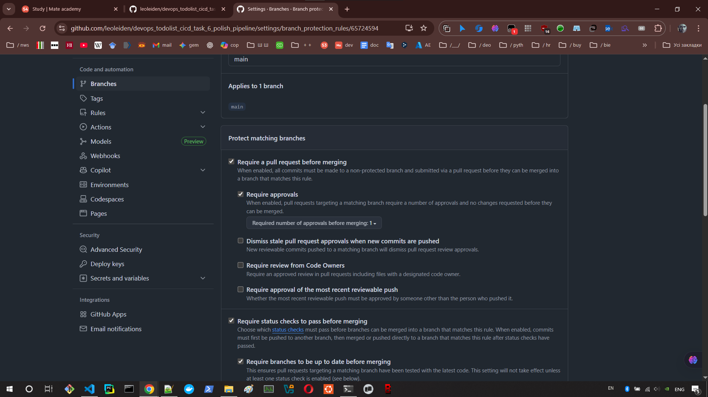
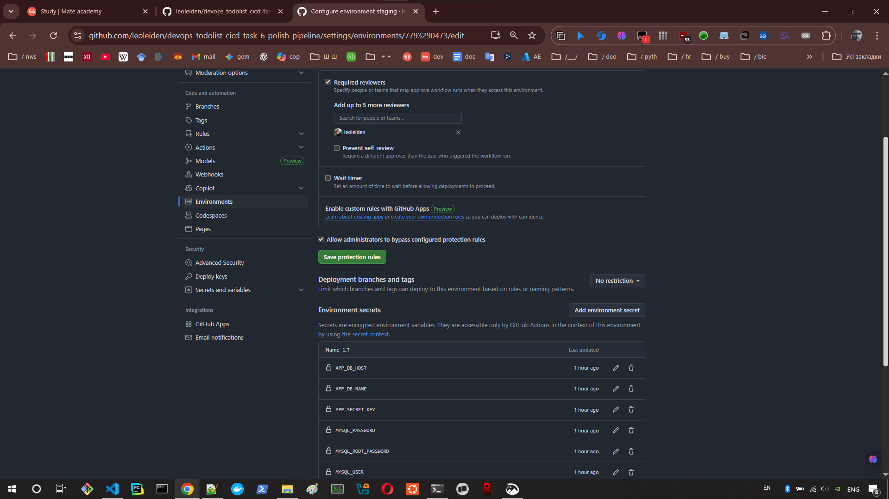
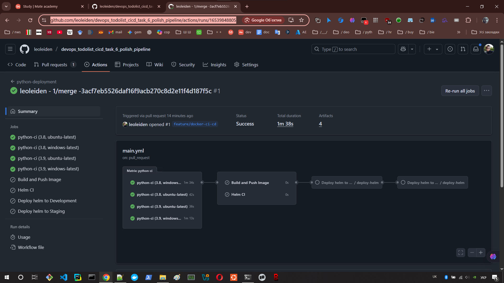
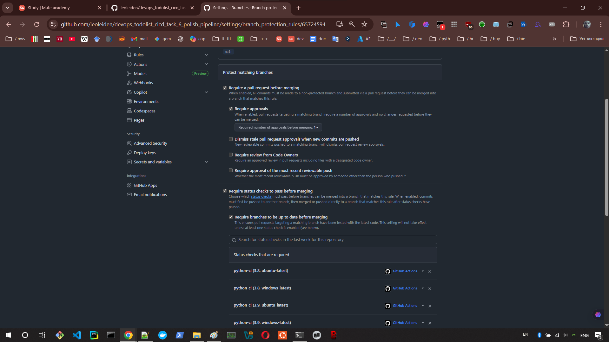
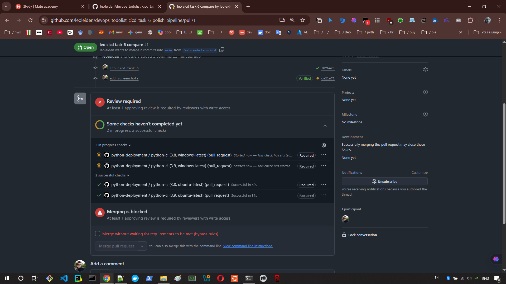

# Advanced GitHub Actions CI/CD Pipeline

## 📖 Project Overview
This project showcases the implementation of a comprehensive, production-ready CI/CD pipeline using GitHub Actions for a Django-based web application. The primary focus of this project is not the application itself, but the robust automation, repository governance, and containerization strategies applied to its deployment lifecycle.

## 🛠 Tech Stack & Tools
* **CI/CD:** GitHub Actions
* **Containerization:** Docker, DockerHub
* **Application:** Python (Django), SQLite
* **Testing OS:** Ubuntu, Windows

## ⚙️ Pipeline Features & Implementation
The workflow was heavily customized to meet strict DevOps standards:
* **Matrix Strategy:** Configured parallel unit testing across multiple Python versions (3.8, 3.9) and Operating Systems (Ubuntu, Windows) to ensure cross-platform compatibility.
* **Docker Integration:** Automated the building and pushing of Docker images to a DockerHub registry upon successful tests, utilizing GitHub Secrets for secure credential management.
* **Concurrency Control:** Implemented workflow concurrency limits to automatically cancel redundant or outdated runs, saving CI minutes and preventing deployment collisions.
* **Manual Triggers & Inputs:** Configured `workflow_dispatch` allowing manual execution of the pipeline with custom input variables (e.g., selecting specific matrix artifacts like `windows-3.8` or `ubuntu-3.9` for deployment).
* **Environment Segregation:** Set up isolated environments (Development and Staging) with environment-specific secrets.

## 🔐 Security & Repository Governance
To enforce code quality and secure deployments, strict repository rules were established:
* **Branch Protection:** The `main` branch is locked. Direct commits are restricted.
* **Mandatory CI Checks:** Pull requests cannot be merged unless the Python CI job (tests and builds) passes successfully.
* **Manual Approvals:** Deployment to the Staging environment requires explicit manual approval from an authorized user.

## 📸 Implementation Evidence
Since repository settings and environment configurations are not publicly visible to non-admins, screenshots of the successful implementation are provided below:

<b>1. Branch Protection & Mandatory Status Checks</b> (Click to expand)

 

 

<b>2. Manual Approval for Staging Environment</b> (Click to expand)

 

<b>3. Workflow Concurrency & Manual Triggers</b> (Click to expand)

 

 

## 📝 Code Review & Approval
This CI/CD implementation has been thoroughly reviewed and validated by a Senior DevOps Engineer. 
You can view the full discussion, implementation details, and final approval in the **[Pull Request #61](https://github.com/mate-academy/devops_todolist_cicd_task_6_polish_pipeline/pull/61)**.
